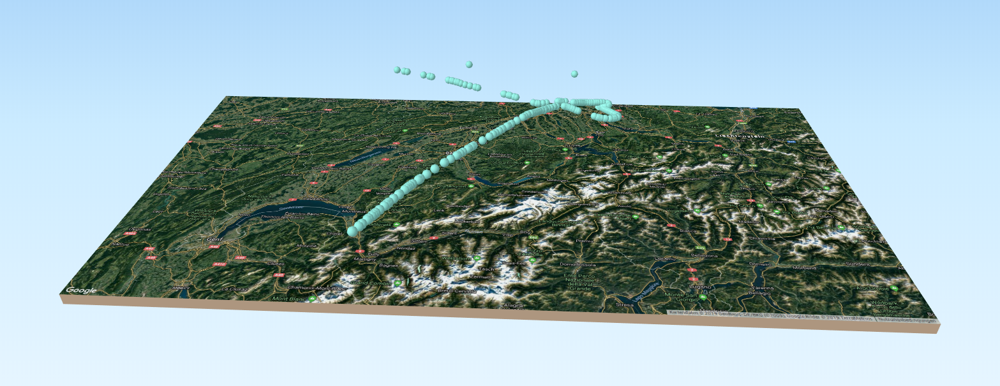

# Up in the Sky!
Here you will find our presentation we had for the Quantum Do.Data, the data to play with and some python scripts. A huge thanks to the team of [Quantum Analytics](http://quantumanalytics.ch/) for letting us talk about things we like.  
Feel free to contact us!

Have a great day!

[Priska](mailto:priska.wallimann@ringier.ch) and [Simon](mailto:simon.huwiler@ringier.ch)

## The stories
* [Gewimmel am Himmel - The Online Story](https://www.blick.ch/storytelling/2018/flugrouten/)
* [Gewimmel am Himmel - The Print Version](infografic/2018_Luftverkehr_fertig.pdf)

## What you will find here
* [Gewimmel am Himmel - The print version](infografic/2018_Luftverkehr_fertig.pdf)
* The Presentation
* [The Data](data_raw/README.md)
* [Scripts](python/)

## Credits - OpenSky Network - Licence
We exported the date from the stunning [OpenSky Network](https://opensky-network.org/). You can use the data for exploration purpose. For forther information, please consider de license! https://opensky-network.org/datasets/states/LICENSE.txt

The description of the data structure is located here: https://opensky-network.org/impala-guide. Scroll to the chapter `The Columns`.

## Preparation for python
### Download this repository
You can either download it by `clone or download` and `download zip` or use your prefered git client. 
### Install GeoPandas
To work with the date, we recommend to use [GeoPandas](http://geopandas.org/), a python library made for geospatial data. It's not allways easy to install, so we don't give you an exact installation documentation.

Theoretically you can install it by pip.  
`pip3 install geopandas`  
For more information, read de [install manual](http://geopandas.org/install.html) or google it.

### Install Jupyter Notebook
All examples run in a jupyter notebook. Install it with pip  
`pip3 install jupyter`

Now open the terminal/console (on Mac: `terminal` on windows `cmd`) and navigate to this repository. Start the terminal with:  
`jupyter notebook`

### Concat files
Because GitHub has a file size restriction, we had to split the data into numerous files. Lets create one big file:
Open the file [python/0 Concatenate Files.ipynb](python/0.%20Concatenate%20Files.ipynb) and run it. This will create the file `/data_generated/20180521.csv`  

### Create a sample
During development, we use a sampled file, to preserve our computer. Run the File [python/1. sampling.ipynb](python/1.%20sampling.ipynb). Be aware: This is not a scientific sample, it will just take every 10th data point.

## Explore
### 2. plot zurich airport.ipynb
This script plots a map of a certain region and saves it as PNG or SVG.

The script: [python/2. plot zurich airport.ipynb](python/2.%20plot%20zurich%20airport.ipynb)

### 3. Swiss Planes Timetable.ipynb
This scripts compares the departure time of longtail and shorttail Swiss planes.

The script: [3. Swiss Planes Timetable.ipynb](python/3.%20Swiss%20Planes%20Timetable.ipynb)
### 4. Create 3D-HTML-Website with QGIS.ipynb
In this tutorial, you learn how to create a 3D-Website (like this one: http://simonhuwiler.ch/doData) with QGIS. You need to install QGIS for this!

The tutorial: [4. Create 3D-HTML-Website with QGIS.ipynb](python/4.%20Create%203D-HTML-Website%20with%20QGIS.ipynb)